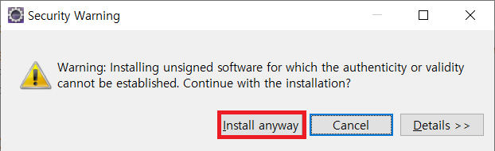
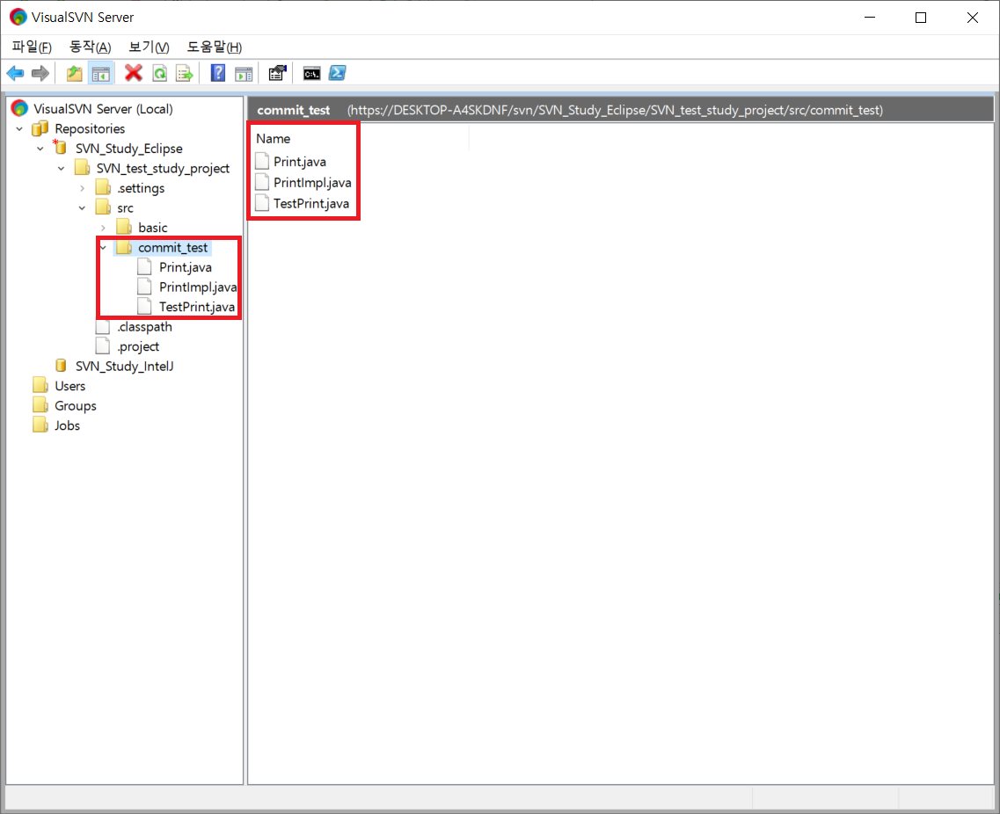
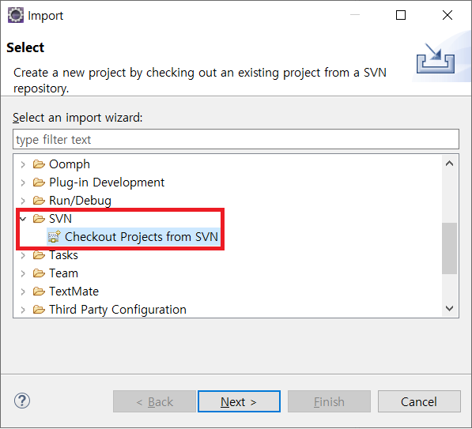

# Eclipse_SVN

## 설치

  
  
  
  
  

---

## 설정

  
  
  
  
  

---

## 저장소 연결

  
  
  
  
  
  
  
  
  

---

## 등록 되지 않은 계정으로 로그인 했을시

  

---

## 계정 로그아웃

  

---

## SVN Project Share

  
  
  
  
  
  
  

---

## commit 와 Update to HEAD

커밋과 동시에 update가 되는 것이 아닌,  
Synchronize 탭에서는 커밋메시지 변경등 다른 옵션을 제공 합니다.

  
  
  
  

---

## Clone

  
  
  
  
  
  
  
  
  
  
  
  

---

## Pull

  
  
  
  

