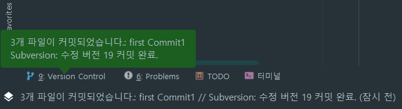

## 설정

[참조](https://goddaehee.tistory.com/196)

  
  
  
  


> 위와 같은 오류가 발생한다면 ...  
> 먼저 svn server을 다운 받고, svn 경로를 설정 해 주어야 합니다.

  
  
  
  
  


> 위와 같이 진행 하셨다면,

```
svn: E170013: Unable to connect to a repository at URL 'https://desktop-a4skdnf/svn/SVN_Study_IntelJ' svn: E175013: Access to '/svn/SVN_Study_IntelJ' forbidden


svn : E170013 : URL 'https : // desktop-a4skdnf / svn / SVN_Study_IntelJ'의 저장소에 연결할 수 없습니다. svn : E175013 : '/ svn / SVN_Study_IntelJ'에 대한 액세스가 금지되었습니다.
```

> 이러한 에러를 만날 수 있습니다.  
> 이 에러는 svn 경로를 설정 할때 폴더의 이름이 띄어쓰기로 되어 있어서 입니다.  
> 예) Program file  
> 해결 방법은
>
> 1.  인텔리제이의 설정한 svn경로를 다시 svn으로 되돌립니다.
> 2.  svn을 제거 재설치 하여 설치경로를 변경합니다.


---

## 저장소 연결

  
  
  
  
  
  


---

## 프로젝트 연동

  
  
  
  
  


---

## 커밋

  
  
  
  
  
  
  
  
  


---

## Clone

  
  
  
  
  
  


---

## FULL

  
  
  
  
  
  
  

