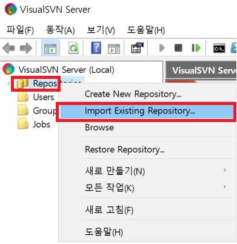

# SubVersion

[참조 - SVN 서버, 소스코드 관리 도구 설치하기](https://goldsony.tistory.com/16)  
[참조 - SVN 서버, 저장소 및 계정 생성하기](https://goldsony.tistory.com/17)

## SVN 이란 ?

[참고 - 위키백과](https://ko.wikipedia.org/wiki/%EC%84%9C%EB%B8%8C%EB%B2%84%EC%A0%84)

서브버전(Subversion)은 자유 소프트웨어 버전 관리 시스템이다.  
 명령 줄 인터페이스에서 사용하는 명령어를 따서 SVN이라고 줄여서 부르기도 한다.  
 제한이 있던 CVS를 대체하기 위해 2000년부터 콜랩넷에서 개발되었다.  
 현재는 아파치 최상위 프로젝트로서 전 세계 개발자 커뮤니티와 함께 개발되고 있다.

서브 버전은 클라이언트 서버 모델을 따른다.  
서버는 작업하는 컴퓨터내에 둘 수도 있고, 전산망에 연결된 별도의 컴퓨터에 두고 사용할 수도 있다.  
서브버전 서버와 클라이언트는 http, https, svn, svn+ssh의 규약으로 통신한다.

---

## SVN 관련 사이트

아래의 두 사이트가 대표적인 사이트로 보입니다.

[VISUALSVN - VISUALSVNSERVER](https://www.visualsvn.com/)

[Tortoise SVN](https://tortoisesvn.net/)

---

## SVN 설치하기

[VISUALSVN 공식문서 설치 도움말](https://www.visualsvn.com/server/getting-started/)

이 문서에서는 VisualSVN 을 사용 함으로, VISUALSVN을 설치해보독하겠습니다.

[VISUALSVNSERVER](https://www.visualsvn.com/server/download/)

본인의 컴퓨터에 맞는 bit 수로 다운 받아 설치하면 되겠습니다.

  
  
  
이 문서에서는 SVN 계정을 이용 할 것이므로, 위와 같이 설정 해 주었습니다.

  
이로서 SVN을 이용할 수 있는 Server 설치를 완료 했습니다.

---

## 저장소(Repository) 생성하기

  

만약 다른 저장소가 있어 추가 하고 싶다면 Import Existing Repository를 합니다.

  
위 화면은 저장소 유형 설정입니다.  
기본적인 유형으로 만들어 보겠습니다.

  
저장소의 이름을 정하시면 됩니다.

  
  

---

## 계정 생성하기

  
  

---

## 저장소 권한 부여

  
  
  

